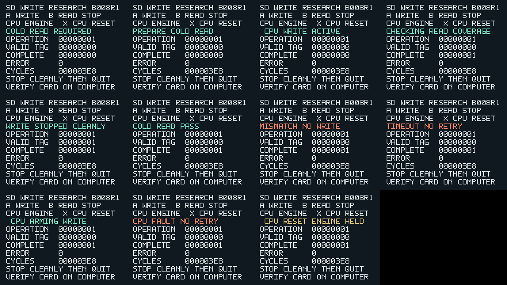

# B008R1 — synthesizable SoC and frozen Pocket candidate

[All results](README.md) · [First mailbox/engine gate](B008_RESULTS.md)

## Goal

Turn the first B008 CPU/engine simulation into an isolated Pocket candidate,
with actual CPU RAM/MMIO wiring, button firmware, explicit reset handling,
a distinct native display, and frozen compilation inputs. Preserve B007 and
all earlier physical outputs. Fit/timing and physical persistence are later
conditions, not inferred from simulation.

## Method

`b008_soc.sv` instantiates the exact pinned VexRiscv, 16 KiB initialized
CPU memory and the already-tested mailbox. The engine remains unchanged.
Fifteen original firmware profiles were replayed on this synthesizable bus;
four additional trials executed the actual 528-byte interactive firmware,
with simulation-only exit addresses disabled. Each final modeled file was
checked word-for-word; 256 KiB trials also used the unchanged B007 oracle.
Native renderer captures covered eleven states. A separate B008R1 top-level,
nominal 60 MHz PLL configuration and timing constraints were frozen with
metadata version 0.8.1 and the stable CARDWRITE02 identity. The new output is
`cpu-b008.bin`, separate from `powercut-b007.bin`.

## Corrections

None recorded in the nineteen SoC execution trials. The B008 renderer initially
inherited the minimal core's orange status-5 colour, incorrectly marking
`COLD READ PASS`. Its separate colour mapping was corrected; all eleven native
states were regenerated and inspected before freezing. B007's renderer was
unchanged. A diagnostic attempt to load an SDC package inside TimeQuest's
Tcl evaluator returned `invalid command name load_package`; its local log is
retained. Constraint syntax uses the documented TimeQuest multicycle command;
actual constraint matching and complete STA remain pending in the fit.

## Result details

**PASS — SoC simulation and native display preparation.** Nineteen actual-CPU
trials: 32 modeled reads, 14 attempted writes, eleven completed writes and six
CPU resets. Four trials ran the exact interactive firmware destined for B008R1.
Three full-size trials matched tag-1 image SHA-256
`00aec285fa738e1225c201774629ea5af4bd630f89f64976fbb5ad632a8f7a6a`.
Top-level Icarus elaboration passed with two inherited data-table address-width
warnings. Simulation PLL/JTAG stubs establish elaboration only.

**Quartus launched; results pending.** Isolated directory
`card-writing-lab/cpu08r1-s1`, seed 1, two workers. The launcher refused competing
processes and checked frozen source hashes before uploading. Estimated completion
is about **20:31 Europe/Lisbon on 2026-10-06**, with a 30–60 minute runtime range
from the approximately 19:46 start. The estimate is based on B007R5's 23:36
runtime plus the CPU, memory and PLL additions; it is not measured fit progress.
No periodic monitoring was restarted. No card, JTAG or Tau source was changed.
Discovery score remains **60/100** until physical CPU persistence is established.

### B008-SOC-01 — replay on the synthesizable bus

**Goal:** Preserve the earlier engine/CPU ownership and refusal guarantees when
replacing the testbench-only bus with actual bounded CPU RAM/MMIO logic.

**Method:** Replay all fifteen first-gate trials: four CPU clock ratios, errors,
late completion after timeout, cold mismatch, missing-plus-duplicate coverage,
idle/read/write reset and reset-plus-timeout. The test-exit decoder is enabled
only for these test-firmware trials. Compare every final file word independently.

**Corrections:** None recorded.

**Result details:** PASS: 24 reads, ten attempted writes, seven completions and
four resets. Fourteen fixtures were 1 KiB; one was 256 KiB. Reduced cases do not
establish exhaustive full-size faults or every reset phase. Test firmware source
and executable hashes are also pinned in the earlier first-gate evidence.

### B008-SOC-02 — interactive clean stop

**Goal:** The actual Pocket firmware must reject A before cold read, start only
after B validation, and interpret B during writes as stop-after-current-command.

**Method:** Execute the 528-byte hardware firmware with the simulation exit
addresses disabled, at 1 KiB and 256 KiB. Drive synchronized A/B button levels,
validate the final read, and request a retained CPU8 telemetry snapshot.

**Corrections:** None recorded.

**Result details:** PASS: two trials, each two reads and exactly one completed
write; exact tag-1 files; no premature write or CPU bus/firmware fault. This
models button sampling and APF completion, not Pocket input/SD latency.

### B008-SOC-03 — interactive CPU-only reset during write

**Goal:** Reset must not clear active ownership; restarted hardware firmware
must wait for safe idle, explicitly recover the mailbox and cold-read again.

**Method:** Repeat interactive trials at both file sizes, resetting the CPU
while the target is acknowledged and DONE low. Engine clock/state continue.
Check no second target owner and exact final bytes; capture CPU8 diagnostics.

**Corrections:** None recorded.

**Result details:** PASS: two resets; each trial finished one write, performed
two reads and matched tag 1. CPU8 reported magic `0x43505508` and zero fault.
Actual X-button/reset-release/PLL-loss behaviour requires hardware evidence.

### B008-SOC-04 — native display and top-level wiring

**Goal:** Make build identity and states unambiguous without changing B007 UI.

**Method:** Capture eleven actual 320×240 renderer states; inspect an unscaled
four-column grid, then elaborate the entire B008 top-level with simulation-only
vendor PLL/JTAG stubs.

**Corrections:** Corrected the status-5 success colour in B008 only; regenerated
and reviewed before freezing.

**Result details:** PASS: B008R1 title and A/B/X controls are legible; pass/stop
are green, mismatch/timeout/CPU fault orange, reset amber. Elaboration passed;
two inherited 10-bit-to-8-bit data-table port warnings remain. Clock IP, physical
video output and ISSP transport are unqualified by these checks.

### B008-SOC-05 — frozen fit candidate

**Goal:** Compile only the qualified, immutable separate candidate; retain old
results and avoid concurrent Quartus work or premature installation.

**Method:** Validate pinned vendor/CPU/engine hashes, SoC report and capture
hashes; compile the identical interactive firmware; freeze staged inputs and
metadata. Launch through the guarded VM builder in a new directory.

**Corrections:** None recorded in staging or launch. The standalone help
query failure above did not modify sources or start a fit.

**Result details:** LAUNCHED / PENDING. Timing uses first-synchronizer-stage
exceptions plus narrowly named three-destination-cycle setup / two-cycle hold
exceptions for stable mailbox bundles. Empty required-register matches cause
an STA error. Full fitter/resource, RAM inference, PLL frequency, all corners,
exception matching, warning review and bitstream hashes remain required. The
metadata/fixture package contains no bitstream and is not installable.

### Evidence and scope

- [SoC trial hashes and counts](../../work/evidence/b008-soc-simulation.json).
- [Native display review](../../work/evidence/b008r1-display-review.json).
- [Frozen source manifest](../../work/build/cpu08r1-manifest.json).
- [Preflight/launch record](../../work/evidence/b008r1-preflight.json).
- [Implementation and next gates](../build/B008_IMPLEMENTATION.md).

No physical CPU persistence, actual M10K inference, PLL accuracy, metastability,
external timing margin, playback, arbitrary-file operations or active power-loss
recovery is claimed. The firmware supervises engine-generated images; it does
not yet publish CPU-generated payloads. A CPU hang watchdog is not implemented.
